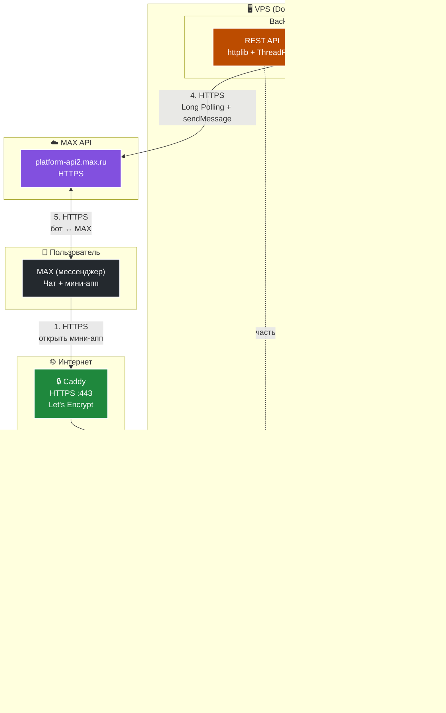

# 📑 DocFlow — Цифровой ассистент и мини-приложение для автоматизации жизненных сценариев граждан

Сервис **DocFlow** разработан в рамках хакатона (Команда №82) и представляет собой интегрированное решение на платформе **«Макс»**. Проект предназначен для бесшовного прохождения гражданами сложных организационных этапов путем предоставления комплексного «жизненного патча» — структурированного пакета необходимых госуслуг, регламентированных документов, справок и социальных льгот.

---

## 🎯 1. Назначение решения

Проект решает проблему разрозненности информации и высокой бюрократической нагрузки при смене социального статуса гражданина. **DocFlow** агрегирует требования ведомств и организаций, предоставляет пользователю интерактивный чеклист готовности документов, интегрируется с государственными сервисами для заполнения анкет и минимизирует ручную проверку со стороны принимающих комиссий.

---

## 👥 2. Основной пользовательский сценарий

1. **Инициализация в чате:** Пользователь запускает чат-бот в платформе «Макс». C++ бэкенд, работающий через асинхронный Long Polling, перехватывает событие и формирует кнопку запуска мини-приложения.
2. **Активация цифрового профиля:** Пользователь открывает Web App, где заполняет единую анкету (ФИО, СНИЛС, паспорт, адрес). Данные отправляются на бэкенд и сохраняются в SQLite.
3. **Получение целевого пакета услуг:** При выборе сценария система разворачивает комплексный чек-лист необходимых документов.
4. **Интерактивный контроль:** Сервер динамически отдает структурированный список документов, разделенный на обязательную и дополнительную категории. Каждая позиция снабжена прямой бесшовной ссылкой на Госуслуги.
5. **Мониторинг готовности:** Приложение отслеживает сбор полного пакета, формируя прозрачный статус готовности.

---

## 🏗️ 3. Состав и архитектура решения

Проект построен по **модульной** **многослойной** **архитектуре**:
**Caddy** — **единственная** **точка** **входа** **снаружи** (**HTTPS**),
**Frontend** (**React + Vite**) — **статика** **мини-аппа**,
**Backend** (**C++17**) — **REST API** **+** **Long Polling**,
**SQLite** — **хранение** **данных**.



---

### Компоненты решения

#### 🌐 Frontend (React 18 + Vite + TypeScript)

* **Назначение:** интерфейс мини-приложения внутри MAX.
* **Сборка:** multi-stage Docker build — `npm run build` → `dist/`.
* **Запуск:** Node.js отдаёт статику из `dist/` на порту `4173`.
* **Прокси:** Vite `server.proxy` перенаправляет `/api/*` на `backend:8080`.
* **Сеть:** только внутри `docflow-network`, наружу не торчит.

#### ⚙️ Backend (C++17)

Совмещает **два независимых параллельных контура**:

**1. REST API (сетевой слой):**
* HTTP-сервер на `httplib`, порт `8080`.
* Пул рабочих потоков.
* Эндпоинты: `/api/ping`, `/api/user/:id`, `/api/user/profile`, `/api/universities/:id/documents`.
* Доступ к SQLite защищён `std::mutex`.
* Prepared Statements — защита от SQL-инъекций.

**2. Модуль Long Polling:**
* Отдельный поток, `libcurl`.
* Соединение с `platform-api2.max.ru` через HTTPS.
* Получение сообщений от пользователей в чате MAX.
* Отправка ответов (`sendMessage`).
* Обработка кнопок (`message_callback`).

#### 🔒 Caddy (3-й контейнер)

* **Единственные ворота наружу.**
* **HTTPS** — автоматический сертификат от **Let's Encrypt**.
* **Порты:** `80` (редирект на 443), `443` (HTTPS).
* **Домен:** `noscam.accesscam.org`.
* **Прокси:** все запросы → `frontend:4173`.

#### 💾 Database (SQLite3)

* Файл `/var/lib/max-bot/bot.db`.
* Volume `db-data` — сохранение между рестартами.
* Prepared Statements + транзакции при создании таблиц.
* Автоматическая проверка схемы при старте.

---

### Потоки данных

| # | От | К | Протокол | Что |
|---|---|---|---|---|
| **1** | Пользователь | MAX | HTTPS | Открывает бота |
| **2** | MAX | Caddy | HTTPS | Открывает мини-апп по URL |
| **3** | Caddy | Frontend | HTTP | Проксирование статики |
| **4** | Frontend | Backend | HTTP | `/api/*` через vite proxy |
| **5** | Backend | SQLite | — | SELECT/INSERT |
| **6** | Backend | MAX API | HTTPS | Long Polling + sendMessage |

---

### Команда запуска

```bash
BOT_TOKEN=... docker compose up -d
```

После запуска:
- **Caddy** — получает сертификат автоматически (~30 сек).
- **Мини-апп** — доступен по `https://noscam.accesscam.org`.
- **Бот** — работает через Long Polling.

## 🐋 4. Быстрый запуск (Docker-compose)

Запуск всей изолированной инфраструктуры проекта (C++ бэкенд, процесс Long Polling бота, база данных, React фронтенд и защитный прокси Caddy с автоматическим HTTPS) выполняется **одной командой** из корня репозитория:

```sh
docker-compose up --build -d
```

---

## ⚙️ 5. Параметры окружения и порты

### Переменные окружения (.env)

| Переменная | Контур | Обязательный | Назначение | Пример |
| --- | --- | --- | --- | --- |
| `BOT_TOKEN` | Backend | **Да** | Секретный токен авторизации бота в сети МАКС для Long Polling | `123456:ABC-DEF...` |
| `PORT` | Backend | Нет | Внутренний порт C++ сервера внутри Docker сети | `8080` |
| `VITE_API_TARGET` | Frontend | Нет | Внутренний URL-адрес бэкенда для проксирования API | `http://backend:8080` |

### Сетевые порты
* **`80` (HTTP):** Перехватывает незащищенные запросы и автоматически перенаправляет их на HTTPS.
* **`443` (HTTPS):** Главный внешний публичный порт Caddy Proxy для безопасного доступа платформы МАКС и жюри к Web App и REST API по адресу `https://accesscam.org`.
* **`4173`:** Внутренний порт Vite фронтенда (полностью скрыт внутри Docker-сети через `expose`).
* **`8080`:** Внутренний порт C++ сервера (полностью скрыт внутри Docker-сети).

---

## 📦 6. Зависимости и интеграции

### Технологический стек и файлы зависимостей:
* **Backend:** C++17, `libcurl` (асинхронный транспорт для удержания Long Polling канала связи с МАКС), `SQLite3` (хранилище), `nlohmann/json` (сериализация). Зависимости сборки фиксируются в `server/CMakeLists.txt`.
* **Frontend:** Node.js 22, React 18, Vite. Зависимости и версии библиотек жестко зафиксированы в файле `frontend/package-lock.json`.
* **Тестирование:** Python 3, `jsonschema`, `pyyaml`. Зафиксировано в `requirements.txt`.

### Внешние интеграции:
1. **API Платформы МАКС:** Двусторонний асинхронный обмен сообщениями и событиями команд через механизмы Long Polling.
2. **Портал Госуслуг:** Внешние бесшовные ссылки на целевые регламентированные формы получения документов.

---

## 💾 7. Работа с данными и тестовые сценарии

### Описание структуры БД:
Данные хранятся в файле `application.db`. Схема включает:
* Таблицу `users` с автоматическим трекингом даты изменения (`updated_at` в ISO 8601). Поля ФИО хранятся раздельно по правилам нормализации СУБД, а метод `User::fullName()` динамически склеивает их при выдаче.
* Таблицу `documents` с жестким ограничением типов (`CHECK` на категории `mandatory`/`additional`).
* Индекс `(university_id, category, "order", id)`, гарантирующий выборку документов вуза СУБД SQLite в отсортированном виде на уровне ядра базы данных.

### Порядок работы с тестовыми данными (Seed):
В проект встроен механизм **автоматического сидинга**. При первом запуске сервера с пустой базой данных система автоматически считывает требования со скриншота Госуслуг и наполняет SQLite 9-ю эталонными документами для вуза `"bmstu"` с жестко выставленными приоритетами `order`.

---

## 🧪 8. Пошаговый сценарий проверки роботом-валидатором

В корне репозитория развернут эталонный комплект автоматического контроля качества API в соответствии со спецификацией **DATA-API 1.0**:

1. На сервере автоматической проверки жюри запускается скрипт-валидатор, сопоставляющий сценарии тестов с официальным контрактом путей:
   ```bash
   python validate_data_api.py DATA-API.yaml --openapi ./openapi.yaml
   ```
2. **Сценарий `DATA-API.yaml` выполняет следующие автоматические шаги:**
   * **`health`:** Отправляет `GET /api/ping`. Ожидает `200 OK` и строгое совпадение JSON-схемы ответа `{"ok": true}`.
   * **`upsert-user-profile`:** Отправляет `POST /api/user/profile` с динамической переменной тестового пользователя платформы `"${userId}"`. Ожидает успешную запись. Метод `extract` перехватывает сгенерированный ID в переменную `savedUserId`.
   * **`read-user-profile`:** Динамически вызывает `GET /api/user/{userId}`, подставляя из памяти `savedUserId`. Жестко сверяет структуру всех 8 полей ответа из SQLite (`exists`, `passport`, `snils` и т.д.).
   * **`get-university-documents`:** Запрашивает `GET /api/universities/bmstu/documents` по домену `https://accesscam.org`. Проверяет корректность выдачи массивов `mandatory` и `additional` и их сортировку.

---
